# Interspeices Knowledge Transfer for Facial KeyPoint Detection（跨物种脸部关键点检测知识迁移）

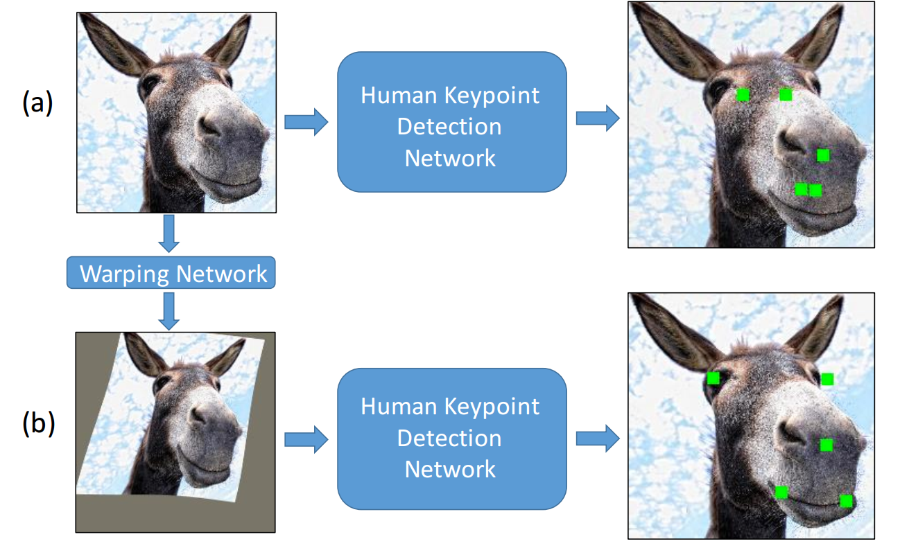

## 一、介绍

​	本文主要涉及到变换将人脸关键点检测的方法以及已有知识转移到其他动物脸部识别中，借助迁移学习避免大量收集动物脸部照片再重新建模训练的麻烦，提出了一种使动物脸部图片变型来克服结构性差异，用人脸识别网络来识别动物脸部的方法。

​	

## 二、思路

​	动物脸部识别目前存在着的问题是：

* CNN训练需要大量数据集
* 目前缺少大量已经标记关键节点的数据集

Solution:         __**迁移学习**__

> 当满足下列要求时：
>
> * 任务间具有相关性的
> * 存在可用以微调CNN的足够数据集
>
> 可以借助已有的Pretrained CNN，借助相对少量的数据集进行微调，使之能够实现克服缺少足够规模的数据训练新网络的困难，完成目标任务 [论文link](http://202.38.196.91/cache/5/03/www3.ntu.edu.sg/8c6832e43234cd403cdf07281033bb2f/TLsurvey_0822.pdf)

​	目前人脸识别数据集庞大，像facenet、deepface的训练集都达到百万级别，而关于动物脸部关键节点的数据集规模也就大概1000 images，相当小，如果能采用迁移学习，可以事半功倍。

​	但同时存在着人脸和动物脸之间有结构性差异，比如说马脸比人脸长，眼鼻的间距大，他们鼻孔间距跟脸部宽度的比例也跟人的差别很大，所以直接的迁移效果一定很差，就像本文一开始的a)图一样。

​	本文最显著的贡献就在于提出了一个wraping network，通过对动物的图片在进出human face detection network 进行了变形和还原，从而解决了人脸和动物脸的结构差异问题。

​	另外人脸和动物脸还存在着外观的差异，比如马的鬓毛，如猫的脸部的毛发颜色变化等等，这些可以通过微调的数据集对CNN微调以适应。

## 三、方法

#### 1. Nearest neighbors with pose matching (基于pose的最近邻匹配)

​	本步骤主要是为了给wraping network 提供训练的数据。主要思路为：以pose相近的人脸为模板，对于动物脸部图片进行图像的TPS（薄板样条法）的变换，是两者结构上输出相近。

​	文中给出脸部距离的计算方法是通过关键点间连成的角度大小来近似的：

如下图，由于不同的pose，可能导致某些关键节点被遮挡，需要采用不同的匹配关键节点，文中给出的情况有

* 当双眼和鼻子可视时，∠*=∠N Ec V  (N:Nose Ec: the centre of the line between two eyes V: Vertical line centred at Ec)
* 当左眼（右眼）不可见时，∠*=∠El N Ml   (=∠Er N Mr  )(El: left eye Ml: the left corner of mouth)

​	当采用K=5时的k-NN实验结果如下:

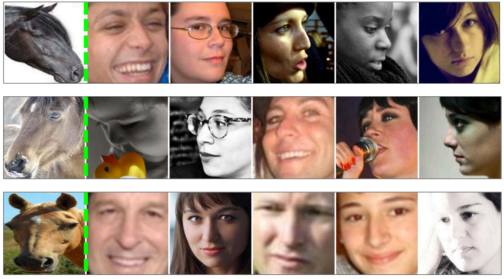

​	K的数量并不是多多益善的，这要结合你使用的human face dataset，文中使用的是AFLW dataset，当K增大到一定程度的时候，会可能因为带来噪声从而是结果变差，这点在实验部分细说。

​	值得注意的是，这pose matching 只是为wraping network提供训练数据，并不参与testing，毕竟testing的时候我们就没有做好脸部关键点标注的动物图片。

#### 2.Interspecies face wraping network （跨物种脸部变形网络）

​	这个网络采用的是监督学习，输入的是input image ，输出的是变换后的图片。

​	在这个学习之前，我们首先要利用的是动物脸部图片的关键节点和人脸的关键节点的匹配对，计算TPS函数的2*（N+3）个参数，然后进行一个TPS变换，利用源图片生成变换后的图片作为监督用的图片。

​	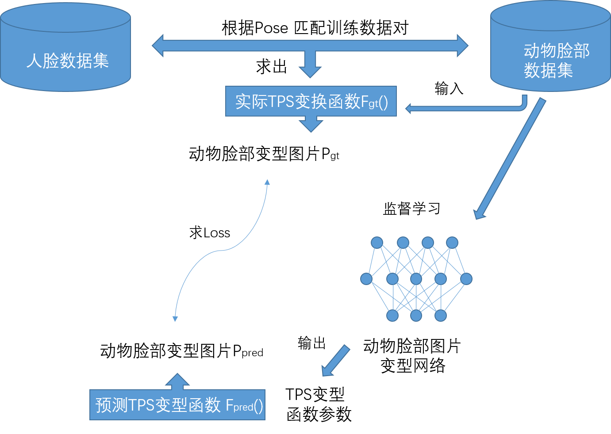

​	关于TPS的解释，这篇[blog](https://blog.csdn.net/victoriaw/article/details/70161180)解释的非常透彻。以下是来自该博文的部分摘要：

> 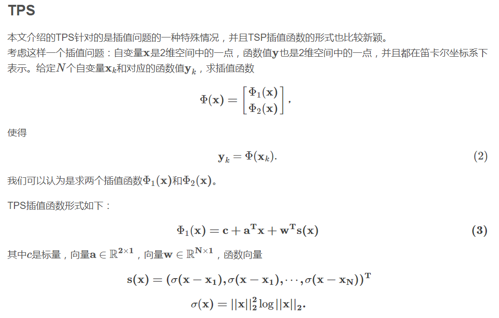

​	然后我们就可以利用变换前的图片和变换后的图片对网络进行监督学习，当训练结束后，我们就可以直接输入动物脸部图片，输出变换后的图片。

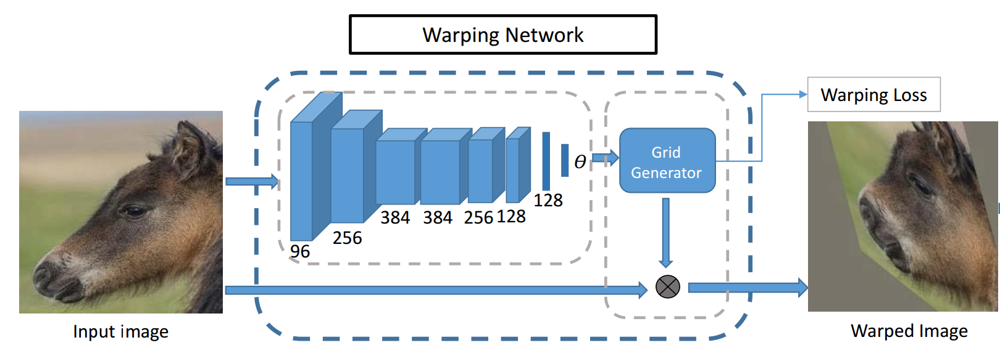

​	网络主要结构类似Localization network（定位网络），直到第五层卷积层都和Alexnet一样，然后后面接着是以1x1为过滤器的一层卷积层和两个全连接层，而且后面三层都先经过Batch Normalization处理。而前五层则是利用ImageNet预训练，后面的三层则是完全由我们的前一step中match得到的image pairs来训练。

​	对于每一张input image， 文中使用了TPS（薄板样条法），选择了5个关键节点，利用关键节点对从而计算出TPS的函数的参数，得到TPS变型函数，然后对输入图片进行变换得到 Ground Truth Wrapped Image。 类似下图，通过对image进行变形，使得待变换点的变换到与目标点一致：

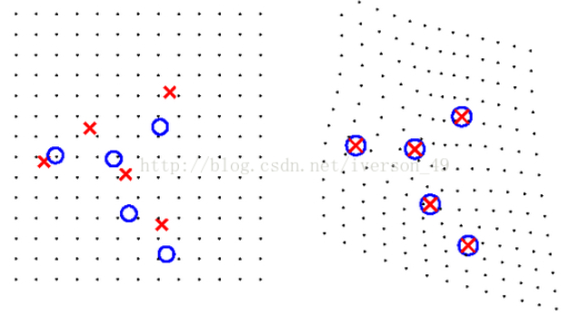

​	对于变形后的图片会用padding 来使它保持原来的size。文中提出先对wraping network进行训练，然后再结合下一步的关键点预测网络一起训练效果更佳。

​	文中对于wraping network 的loss计算是通过计算对应的像素的偏差的L2范数和，另外训练的时候是将K个match都用做训练，会尝试多个训练变形，多次纠正当作潜在的正确的变形，当作data augmentation，可以一定程度上提高泛化，对于特定的离群值点的敏感程度会有所下降。

#### 3. Animal keypoint detection network (动物关键点检测网络)

​	对于关键点的网络结构是Vanilla CNN的一种变型，如下图所示，四层卷积网络，还有两层全连接层，这两层连接层用到的tanh作为非线性的激活函数，另外再最后的三层卷积层输出都经过max-pooling。相对于别的使用40x40作为输入的网络，通过额外的卷积层和max-pooling能够让网络适应更大的input  image。另外对于tanh作为activation function，很容易趋向饱和，也就是可能导致梯度变化太小甚至近乎于0，所以每一层之后都采用了BN。

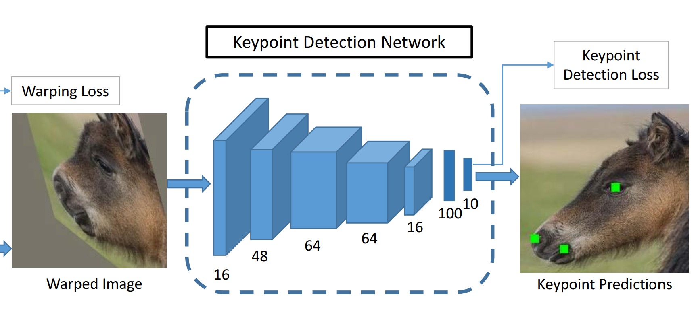

​	对于关键点的检测网络的损失计算，如下图所示。这里用到的使Smooth L1 loss：

​	smooth L1(x)其实就是一个对于一个折线函数在近原点处做了一个圆滑处理。

#### 4.Final Architecture (最终结构)

​	

​	最终结构如上图，训练时首先预训练wraping network，然后将两个网络连在一起，然后wraping network的损失会与Keypoint detection BP传来的loss结合后再更新。

​	文中最后还提及他们贡献了个马脸关键点数据集，这里就不说了。

## 四、实验

#### 1. 对比的Baselines

​	文中用了四种对比的baselines，包括有

* TIF	(triplet-interpolated features，三线插值特征)在倒金字塔的架构下面对于关键节点的识别、
* BLFT 就是相对于文中结构没有wraping network，直接对人脸特征点识别网络进行微调、
* BLTPS 相对于文中网络没有对wraping network loss的
* SCARTCH 直接训练一个识别关键节点的网络

​	后面三者都是为了说明文中提出的结构的必要性，第一个当然就是为了想说明自己的结构相对于原有结构的进步。

​	试验中用到的5个关键节点分别是，左/右眼，左/右嘴角，还有就是鼻尖。运用的人脸的dataset就是AFLW，而动物脸就用了一个他们收集的马脸dataset，还有一个就是羊脸dataset。而评价一个关键节点的fail与否，用的是这个关键点预测与Ground truth的距离是图片超过size的10%。（这个评价标准是不是有点太宽松了），然后实验的对比结果如下：

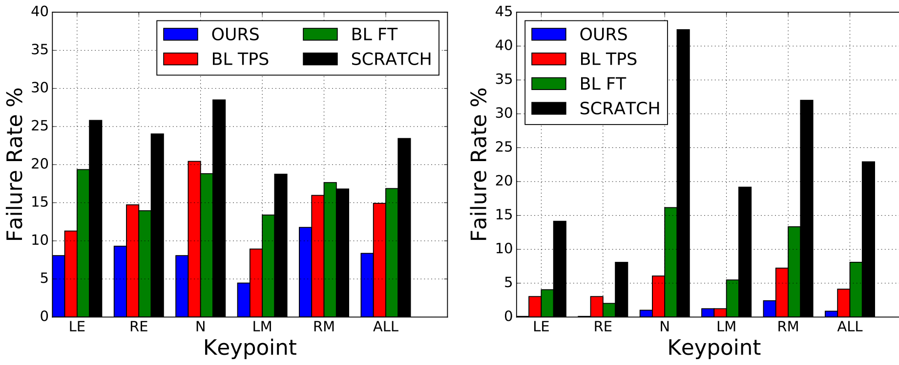

​	训练TPSwarping network 的时候，用的是5x5的grid of control points，然后利用的Adam优化方法。wraping network 的 Base learning rate 是0.001，但是呢，这不是一成不变的，对于预训练的网络层，只是1/10。然后整个warping network是会预训练50epochs，后25epochs的训练就会下降为1/10。

​	然后如果整个网络一起训练（包括关键点预测网络），那么warping network 的learning rate 就是0.001，而预测网络就是0.01，并且整个网络训练150epochs，每50epochs learning rate下降为1/2，同时用了水平翻转和+-10°的旋转作data augmentation。

​	

​	这里羊脸和马脸的差别，明显羊脸比马脸识别好，文中说，羊脸的正面照多一些，也就是5个关键节点都同时出现的情况多，易于识别。

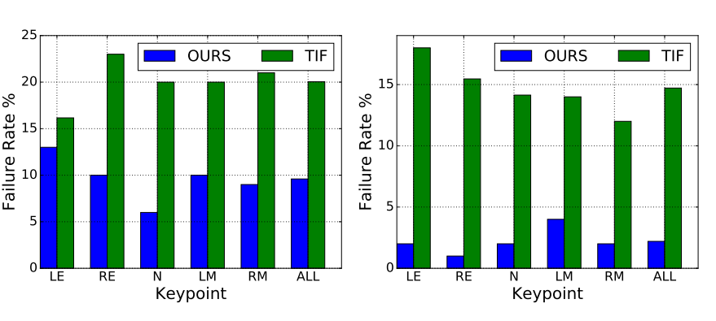

​	然后各种花式吹模型。。。看看就懂了

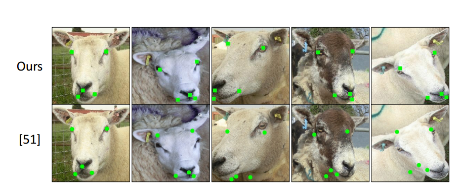

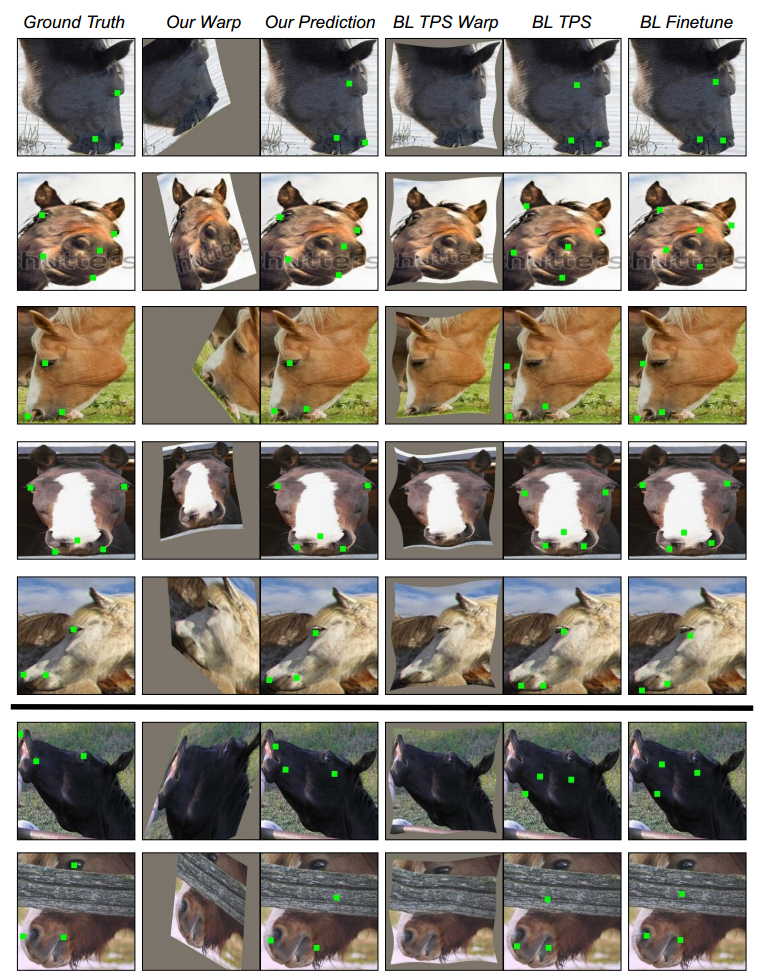

​	前面提到的，fine-tune训练数据当然多多益善，然后对于K-NN匹配的人脸来说却不一定，毕竟可能匹配的多了就混进噪声了，而且越多混进的match的距离就越远了，当然这个K只是针对他用的AFLW数据集而言的：

​	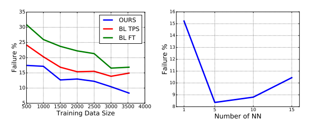

​	利用了知识迁移，一定程度的克服了动物脸部关键点识别数据集过小的问题，也利用了人脸识别的已有网络利用相对少量的数据集得到更为优异的结果。另外，为了说明warping network的必要性，也为了说明变型越准，迁移后的识别能力越强，做了下面的对比：

​	

​	

## 五、总结

​	这篇paper比较创新的地方在于运用了迁移学习解决动物脸部关键识别方面遇到的数据集小的问题，联通了一个hot topic 或者说是 mature topic和一个相对冷门的topic，利用迁移提供了一个相对从头收集数据训练来说的一个捷径。提出了将训练数据变型以适应人脸识别网络的新奇思路，开拓了知识迁移的方法。

​	但是还是有着一定的不足，或者说留给开拓的范围还有很多：

* 实验中用到的只是5个关键点，如果识别更多的关键点是否也是避免不了对数据集size的要求，尤其是如果要达到动物脸部识别到人脸识别等级，提取的关键点达到数十个的时候。
* 动物脸部和人脸，即使在图像变型后，外表还是存在着比较大的差异，另外动物脸部相对于人脸更容易遮挡关键点
* 同时动物的毛色是否应当纳入识别的范围？如果纳入，动物脸部的污垢对于毛色识别如何解决？
* 如果我们使用一个更优异的预训练的人脸识别网络，通过fine-tune，是否意味着取得更好的表现效果呢？
* 文中使用的是TPS图像变型，如果我们使用另外一种变型方法，是否会取得一个更好的训练效果呢？
* 文中提出的近邻匹配方法，只是提出某些关键点的连线夹角，这种匹配对于不同的动物而言，应该针对其结构特征有所不同，是否意味着有更优的匹配方式？

